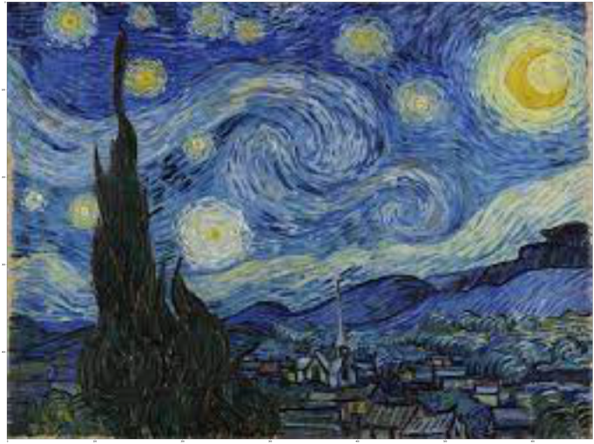
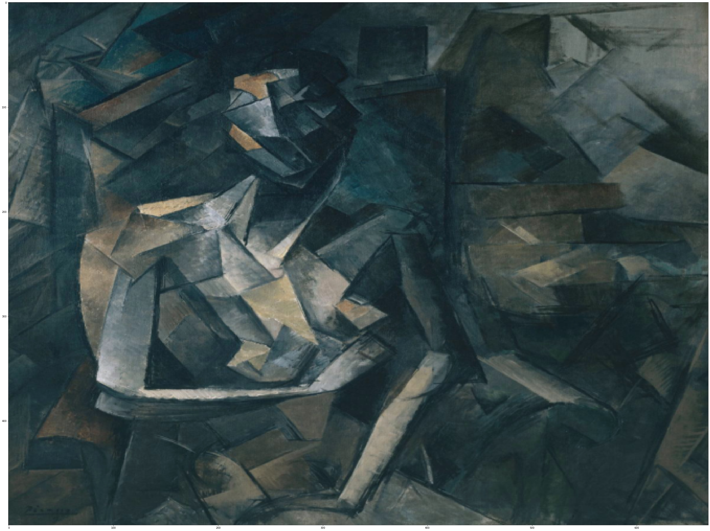

## Table of Contents
1. [About](#About)
2. [Curious Points](#Curious-Points)
3. [Technologies](#Technologies-Used)

### About
***
The project is based on the paper - [Image Style Transfer Using Convolutional Neural Networks.](https://www.cv-foundation.org/openaccess/content_cvpr_2016/papers/Gatys_Image_Style_Transfer_CVPR_2016_paper.pdf)

A Neural Algorithm of Artistic Style that can separate and recombine the image content and style of natural
images. The algorithm allows us to produce new images of high perceptual quality that combine the content of an arbitrary photograph with the appearance of numerous well-
known artworks.
I have provided several examples below for showing the beauty of this project. Soon, I will try to host it on web for general use and testing.

### Screenshot

#### Content images

 

#### Stylised final images

 

 

  

 

 

#### Art images used:

.png)

 

## Curious Points
* The best use of this project I see is to create art! Other than that, speculating on more technical uses, I personally gained a lot of insights on how
Convolutional Neural networks actually work. It allows us to visualise each aspect of the layer and tweak our code for desired results.

* Here we must know that since each artistic image has a different style/texture, by style or texture I mean, a different set of brush strokes, colors, patterns and so on.
This results in non-uniform outputs for our content and style images to provide a desired output image. 
Hence, we need to tweak the following paramters based on what kind of image we are trying to use as our style and content-

* Learning Rate
* alpha/beta - linear combination of loss weights ratio.
* Weights for each layer of our convolutional network which determine what kind of features we wish to extract.

Here is an example to show what I mean by this-
* Before Tweaking

 

* After Tweaking

 

Please refer the notebook and annotated paper to understand better.

## Technologies Used
***
A list of technologies used within the project:
* Convolutional Neural Network
* pyTorch 
* python
* Computer Vision
* Research :)
